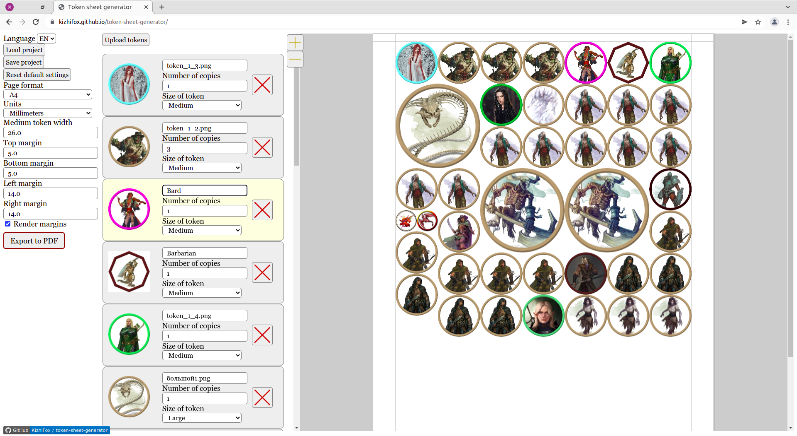
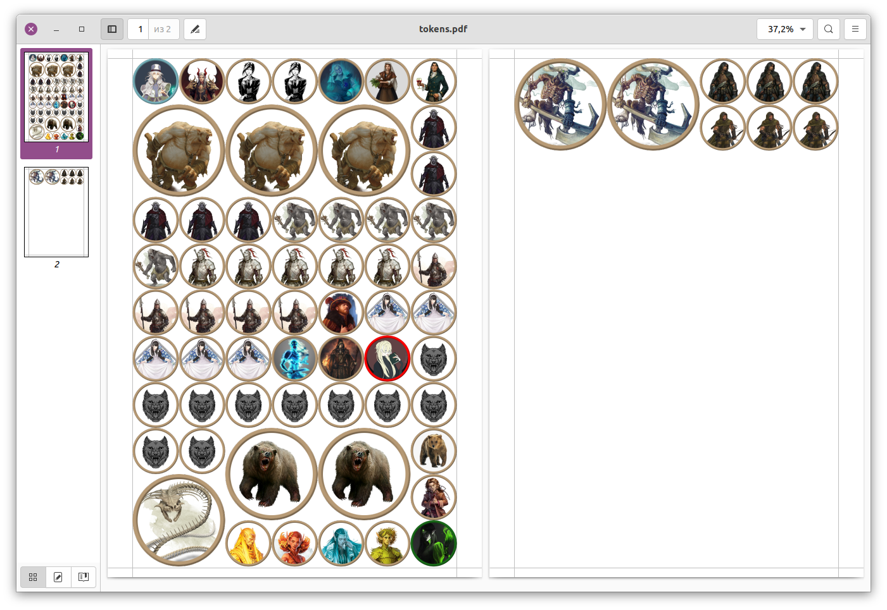

# Token sheet generator

*version 1.1*

This app places tabletop RPG tokens on a PDF sheets, which helps save time in preparing for printing.

App: https://kizhifox.github.io/token-sheet-generator/

Export result:

## Version history

* *0.1 Project start:*
  1. Support for PNG and JPEG format;
  2. Tokens arranged into a list with picture and settings;
  3. Tokens settings: number of copies, creature size;
  4. Document settings: page format, units, medium token width, page sizes, paddings;
  5. PDF export: preview in browser, print or download to device;
  6. Support for multi-page documents.
* *0.2:*
  1. Abitily to save and load your projects.
* *0.3:*
  1. Ability to sort tokens;
  2. New default PDF design;
  3. Changing page height and width to bottom and right margins;
  4. New default settings.
* *0.4:*
  1. Wrong input protection;
  2. Translation into Russian.
* *0.5:*
  1. HTML5 Canvas preview for optimization.
* *0.6:*
  1. Scrolling and scaling support for preview.
* *0.7:*
  1. Drag and drop to upload tokens;
  2. File upload animation;
  3. Loading animation;
  4. GitHub link.
* *0.8:*
  1. Load projects with drag and drop;
  2. Reorder tokens with drag and drop.
* *1.0:*
  1. Simple design.
* *1.1:*
  1. Added .webp and .gif support, fixed error with some .jpeg images. All uploaded images now are just converting to .png.
* *1.1.1:*
  1. Boosty and Mastodon links.

